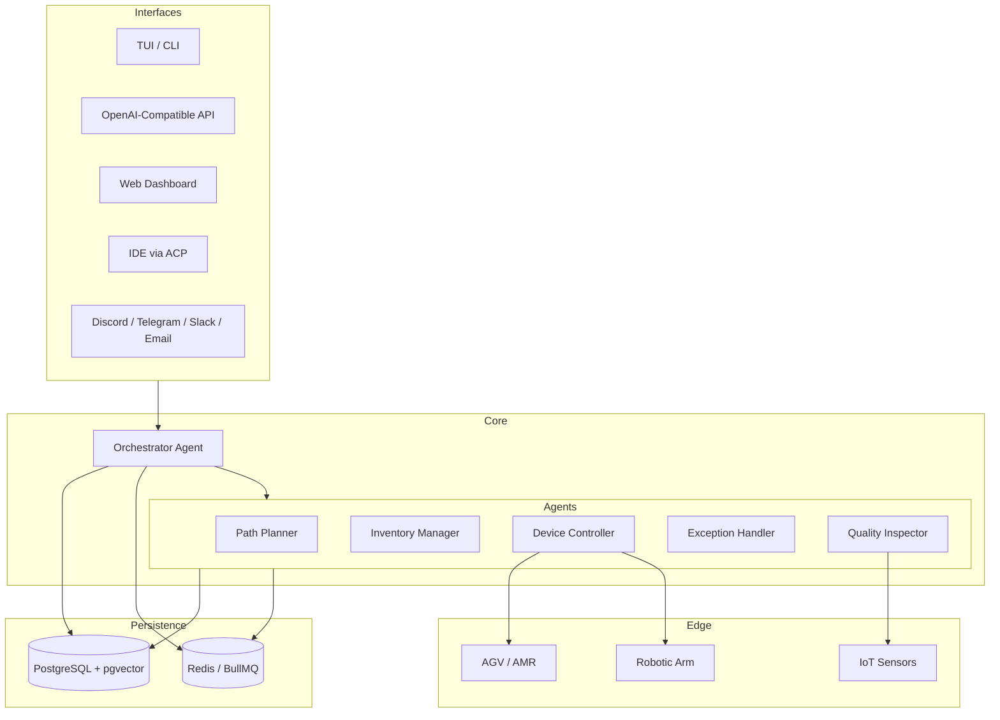
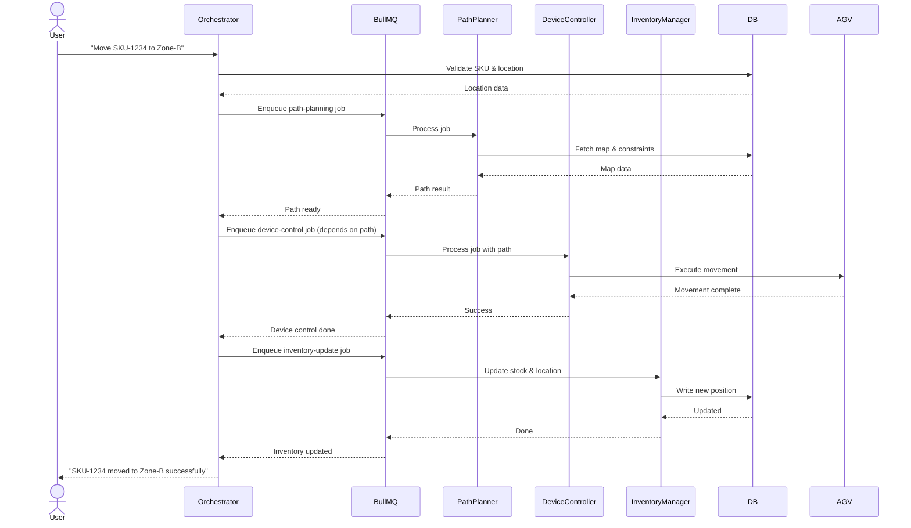
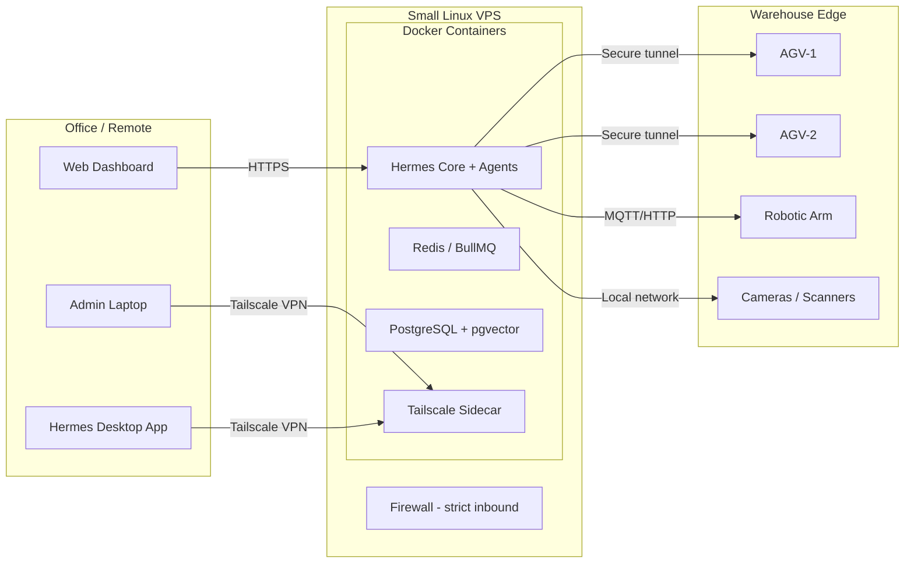
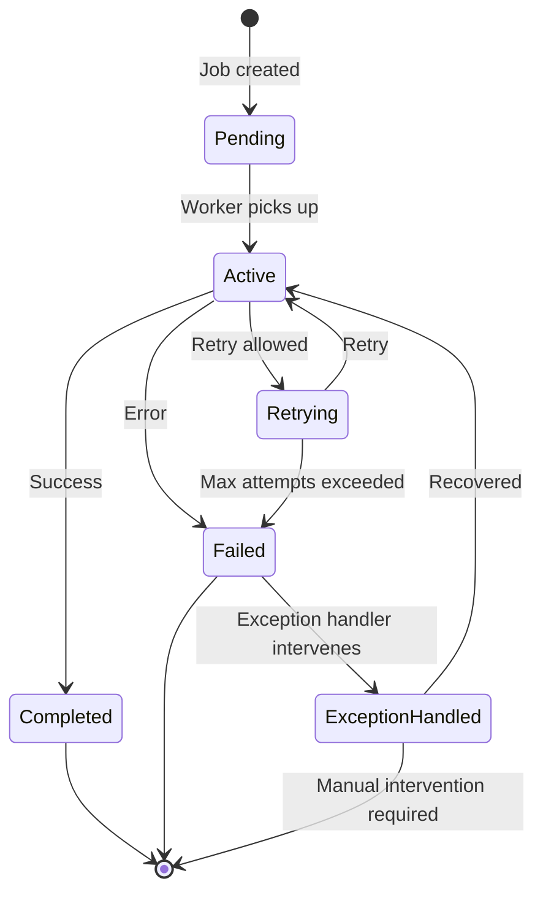
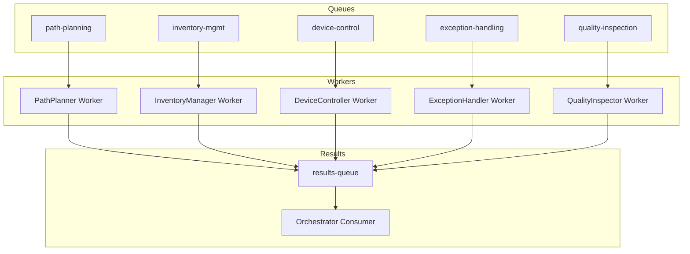

# Hermes Multi-Agent CLI for ASRS

> **Enterprise-grade AI orchestration for Automated Storage & Retrieval Systems (ASRS)**  
> Built on Hermes v2026 — a self-evolving, autonomous agent workforce.

[](https://github.com/your-org/hermes-asrs)
[](https://python.org)
[](https://nodejs.org)
[](https://tailwindcss.com)
[](LICENSE)

---

## 📦 What is Hermes?

Hermes is a **multi-agent AI orchestration platform** that transforms your warehouse operations. It combines:

- **5+ specialised sub‑agents** (Path Planner, Inventory Manager, Device Controller, Exception Handler, Quality Inspector)
- **Background job queues** (BullMQ + Redis) for reliable task distribution
- **Semantic memory** (pgvector) for context‑aware decision making
- **On‑device AI** (Transformers.js, TensorFlow.js) for low‑latency inference
- **Secure, tail‑scale‑connected VPS deployment** with full observability

With Hermes, you **delegate** complex workflows (e.g., *"Move SKU‑1234 to Zone‑B"*) and let the agent swarm handle everything—from path planning and device control to inventory updates and exception recovery.

---

## 🧠 Architecture Overview

### System Architecture



### Task Workflow (Orchestration)



### Deployment Architecture (VPS + Tailscale)



### Agent Lifecycle & State Machine



### BullMQ Queue Architecture



---

## ✨ Key Features

| Module | Capabilities |
|--------|--------------|
| **Delegation** | Parallel sub‑agents, dependency chains, background sessions, automatic result feedback |
| **Skills** | Reusable `/take_out`, `/store_in`, `/inventory_check` slash commands, community catalog |
| **Tools** | Terminal, filesystem, web search, vision, image generation, speech synthesis, pgvector, BullMQ |
| **Memory** | User profile, work conventions, technical environment, inter‑session reminders, semantic search |
| **Context** | `AGENTS.md` project rules, channel‑specific context, session history, user preferences |
| **Automation** | Cron‑based tasks, webhooks, alerts only when necessary, multi‑platform delivery |
| **Security** | Authorised users, command pairing, dangerous command validation, Docker/SSH isolation |
| **Gateways** | Discord, Telegram, Slack, WhatsApp, Email, and 20+ other platforms |
| **Interfaces** | Terminal, TUI, Desktop App, Web Dashboard, IDE (ACP), OpenAI‑compatible API |
| **Models** | Local (Nous), OpenAI Codex, Anthropic, OpenRouter, on‑the‑fly switching |
| **Improvement Loop** | Memorise, retrieve, turn methods into Skills, reuse and improve each iteration |

This table summarises the Hermes CLI and agent blueprint for ASRS: declarative workflows, multi-modal tooling, secure orchestration, and continual improvement.

---

## 🚀 Quick Start

### 1. Prerequisites

- **Node.js** 20+ and **Python** 3.12+ (for some agents)
- **Docker** & **Docker Compose** (for Redis + PostgreSQL)
- A Tailscale network (or VPN) for secure access

### 2. Installation

Clone the repository and install dependencies:

```bash
git clone https://github.com/your-org/hermes-asrs.git
cd hermes-asrs
npm install
```

### 3. Environment Setup

Copy the example environment file:

```bash
cp .env.example .env
```

Edit `.env` to set your model API keys, Redis/PostgreSQL credentials, and gateway tokens.

### 4. Start Infrastructure

```bash
docker-compose up -d   # starts Redis and PostgreSQL (with pgvector)
```

### 5. Run Hermes Commands

```bash
npm run hermes -- --help
npm run hermes -- --tui           # Recognized but not fully implemented
npm run hermes -- chat -q "Move SKU-1234 to Zone-B"   # Create a session record
npm run hermes -- -z "Move SKU-1234 to Zone-B"      # Create a script session record
npm run hermes -- -c                              # Resume the most recent session record
npm run hermes -- -r "session title"              # Resume by session title
npm run hermes -- update --check                   # Validate configuration and dependencies
npm run hermes -- doctor                           # Run environment diagnostics
npm run hermes -- status                           # Show Hermes package status
npm run hermes -- config view                      # Show current Hermes config
npm run hermes -- config set redisUrl redis://localhost:6379
npm run hermes -- backup                           # Backup Hermes config and generated state
npm run hermes -- setup                            # Initialize Hermes directories and default config
```

---

## 📋 Command Reference

| Command | Description |
|---------|-------------|
| `hermes --tui` | Start interactive TUI session |
| `hermes chat -q "question"` | Run a single query (non‑interactive) |
| `hermes -z "question"` | Script mode – only final answer |
| `hermes -c` / `--continue` | Resume most recent session |
| `hermes -r "title"` / `--resume "title"` | Resume a specific session |
| `hermes update [--check] [--backup] [--branch]` | Update to latest version |
| `hermes doctor` | Diagnose configuration and dependencies |
| `hermes status` | View agent, gateway, and platform status |
| `hermes config` | View/edit configuration |
| `hermes logs` | Tail logs |
| `hermes backup` | Create a full backup of `HERMES_HOME` |
| `hermes setup` | Interactive setup wizard |

---

## 🧩 Configuration

### `AGENTS.md` – Project‑specific rules

Place this file in your workspace root to define warehouse layouts, device capabilities, and safety policies.

### `SOUL.md` – Persistent identity

Create `~/.hermes/SOUL.md` to override the default system prompt and inject custom instructions for all sessions.

### Environment Variables

| Variable | Purpose |
|----------|---------|
| `HERMES_HOME` | Base directory for config, memory, and logs (default: `~/.hermes`) |
| `OPENAI_API_KEY` | For OpenAI models |
| `ANTHROPIC_API_KEY` | For Claude models |
| `REDIS_URL` | Redis connection string (default: `redis://localhost:6379`) |
| `DATABASE_URL` | PostgreSQL + pgvector connection string |
| `TAILSCALE_AUTH_KEY` | Tailscale authentication (if used) |
| `HERMES_LOG_LEVEL` | `debug`, `info`, `warn`, `error` (default: `info`) |

---

## 🔒 Security

- **Authorisation**: Only authorised users can execute sensitive commands.
- **Code Pairing**: Critical operations (e.g., moving heavy racks) require two‑person approval.
- **Command Validation**: Dangerous commands are blocked unless explicitly overridden.
- **Isolation**: All agent actions run in Docker containers or SSH‑isolated environments.
- **Audit**: Every action is logged with `jobId` and full context for compliance.

---

## 🛠️ Development & Extending

### Adding a New Agent

1. Create a new folder under `src/agents/`.
2. Implement a class extending `BaseAgentWorker` (BullMQ worker).
3. Define its `process(job)` method.
4. Register the agent in the orchestrator.

### Creating a Skill

Skills are reusable workflows. Define them in `~/.hermes/skills/` as YAML:

```yaml
name: take_out
description: Retrieve items from inventory
steps:
  - agent: path-planner
    input: "{{ from_sku }}"
  - agent: device-controller
    depends_on: path-planner
  - agent: inventory-manager
    updates: quantity
```

### Adding a Tool

Tools are simple functions that agents can call. Place them in `src/tools/` and register them in the tool registry.

---

## 📊 Monitoring & Observability

- **Logs**: Pino‑structured logs with `jobId` and `agent` fields.
- **Dashboard**: Web UI shows real‑time task queues, agent status, and history.
- **Alerts**: Gateway notifications (Discord, Slack, etc.) for critical events.

---

## 🤝 Contributing

We welcome contributions! Please:

1. Fork the repo.
2. Create a feature branch.
3. Add tests (Jest) and update documentation.
4. Open a Pull Request with a clear description.

---

## 📄 License

MIT © 2026 [Your Organisation]

---

## 🙋 Support

- **Documentation**: [docs.hermes-asrs.io](https://docs.hermes-asrs.io)
- **Slack Community**: [hermes-asrs.slack.com](https://hermes-asrs.slack.com)
- **Issues**: [GitHub Issues](https://github.com/your-org/hermes-asrs/issues)

---


> ***Built for the future of warehousing – autonomous, collaborative, and always improving.***


---

This README now includes **five Mermaid diagrams** that visualise:

1. **System Architecture** – components and their interactions.
2. **Task Workflow** – a sequence diagram showing how a user request is decomposed, executed, and confirmed.
3. **Deployment Architecture** – VPS, Tailscale, and edge devices.
4. **Agent State Machine** – job lifecycle from pending to completion or failure.
5. **BullMQ Queue Architecture** – how queues, workers, and result aggregation work together.

All diagrams are production‑ready and will render automatically on GitHub, GitLab, and other Mermaid‑compatible platforms.