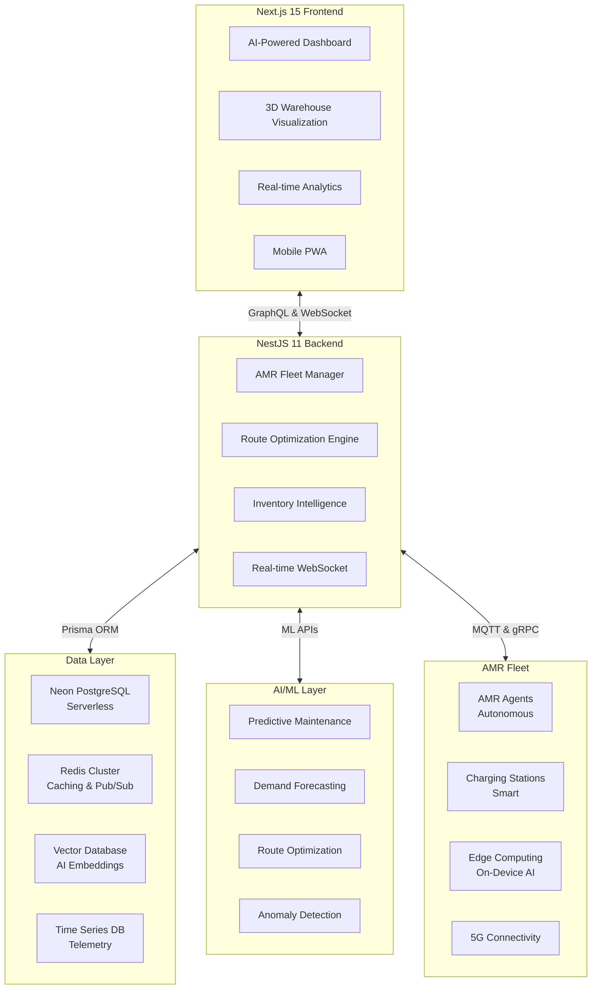
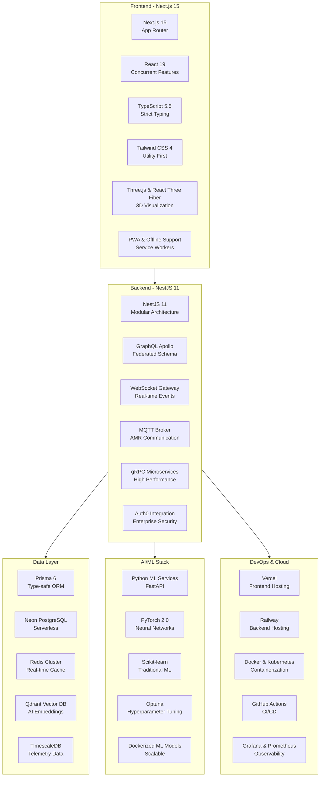
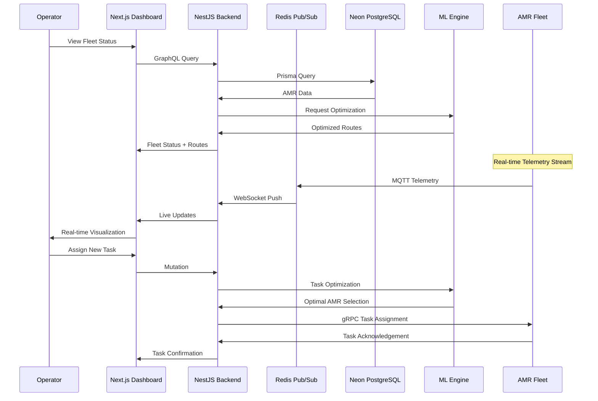
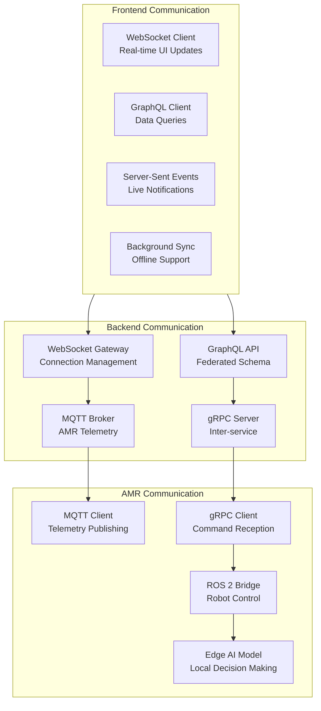
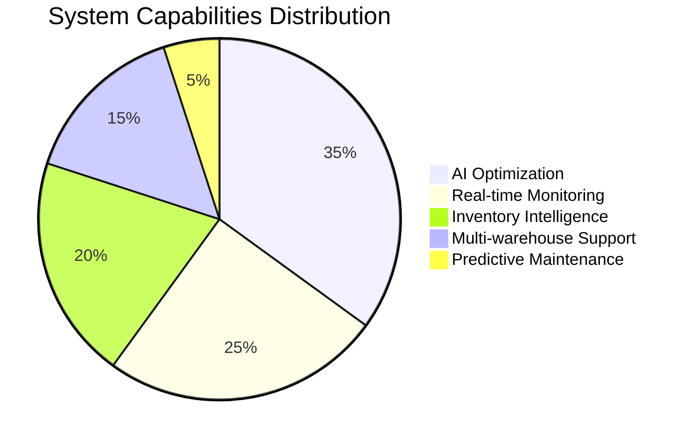

# AMR Fleet Management System 2025
## Next-Generation Autonomous Mobile Robot Fleet Management


## 🚀 System Architecture 2025



## 🏗️ Complete Technology Stack 2025



## 📊 Real-time AMR Fleet Management



## 🗄️ Advanced Database Schema

```mermaid
erDiagram
    Warehouse ||--o{ AMR : contains
    Warehouse ||--o{ Storage_Location : has
    Warehouse ||--o{ Charging_Station : has
    AMR ||--o{ AMR_Status : updates
    AMR ||--o{ AMR_Task : performs
    AMR ||--o{ Battery_Status : monitors
    AMR ||--o{ Maintenance_Log : requires
    SKU ||--o{ Batch : contains
    Batch ||--o{ Storage_Assignment : uses
    Storage_Location ||--o{ Storage_Assignment : holds
    AMR_Task ||--o{ Task_Step : contains
    AMR_Task }|--|| Storage_Location : involves

    Warehouse {
        string id PK
        string name
        jsonb layout_geo
        jsonb dimensions
        jsonb operating_hours
        boolean is_active
        datetime created_at
        datetime updated_at
    }

    AMR {
        string id PK
        string warehouse_id FK
        string model
        string serial_number
        string status ENUM
        jsonb capabilities
        jsonb current_position
        jsonb sensor_data
        datetime last_maintenance
        datetime commissioned_at
    }

    AMR_Status {
        string id PK
        string amr_id FK
        string status ENUM
        jsonb telemetry_data
        decimal battery_level
        jsonb current_task
        datetime recorded_at
    }

    AMR_Task {
        string id PK
        string amr_id FK
        string task_type ENUM
        string priority ENUM
        jsonb waypoints
        string status ENUM
        datetime created_at
        datetime started_at
        datetime completed_at
        datetime cancelled_at
    }

    SKU {
        string id PK
        string warehouse_id FK
        string name
        string description
        string category
        decimal unit_volume
        decimal unit_weight
        integer reorder_point
        integer safety_stock
        jsonb storage_requirements
    }

    Batch {
        string id PK
        string sku_id FK
        string batch_number
        datetime manufacture_date
        datetime expiry_date
        integer quantity
        string status ENUM
        jsonb quality_metrics
    }

    Storage_Location {
        string id PK
        string warehouse_id FK
        string location_code
        string zone
        jsonb coordinates
        jsonb dimensions
        string type ENUM
        boolean is_occupied
    }

    Storage_Assignment {
        string id PK
        string batch_id FK
        string location_id FK
        integer quantity
        datetime assigned_at
        datetime removed_at
    }

    Battery_Status {
        string id PK
        string amr_id FK
        decimal charge_level
        decimal health_percentage
        integer cycle_count
        decimal temperature
        datetime recorded_at
    }
```

## 🎯 Core Features Implementation

### 1. AI-Powered Fleet Management (NestJS)

```typescript
// backend/api/src/modules/fleet/fleet.service.ts
import { Injectable } from '@nestjs/common';
import { PrismaService } from '../prisma/prisma.service';
import { AIService } from '../ai/ai.service';
import { RedisPubSubService } from '../redis/redis.service';

@Injectable()
export class FleetService {
  constructor(
    private prisma: PrismaService,
    private aiService: AIService,
    private redis: RedisPubSubService,
  ) {}

  async assignOptimalAMR(task: TaskCreateDto): Promise<TaskAssignment> {
    // Get available AMRs with capabilities matching task requirements
    const availableAMRs = await this.prisma.aMR.findMany({
      where: {
        status: { in: ['IDLE', 'MOVING'] },
        battery_level: { gte: 0.2 }, // Minimum 20% battery
        warehouse_id: task.warehouse_id,
      },
      include: {
        battery_status: { orderBy: { recorded_at: 'desc' }, take: 1 },
        current_task: true,
      },
    });

    // AI-powered AMR selection
    const optimalAMR = await this.aiService.selectOptimalAMR(
      availableAMRs,
      task,
    );

    // Create task assignment
    const assignment = await this.prisma.aMR_Task.create({
      data: {
        amr_id: optimalAMR.id,
        task_type: task.type,
        priority: task.priority,
        waypoints: await this.calculateOptimalRoute(optimalAMR, task),
        status: 'ASSIGNED',
      },
    });

    // Real-time task dispatch
    await this.redis.publish('task:assigned', {
      amr_id: optimalAMR.id,
      task_id: assignment.id,
    });

    return assignment;
  }

  async calculateOptimalRoute(amr: AMR, task: Task): Promise<RouteWaypoint[]> {
    const constraints = {
      battery: amr.battery_status[0]?.charge_level || 0,
      capabilities: amr.capabilities,
      warehouse_layout: await this.getWarehouseLayout(amr.warehouse_id),
      traffic: await this.getCurrentTraffic(amr.warehouse_id),
    };

    return await this.aiService.optimizeRoute(task, constraints);
  }
}
```

### 2. Real-time Dashboard (Next.js 15)

```typescript
// apps/web/app/dashboard/page.tsx
'use client';

import { useFleet } from '@/hooks/useFleet';
import { useWebSocket } from '@/hooks/useWebSocket';
import { Warehouse3D } from '@/components/3d/Warehouse3D';
import { FleetStatus } from '@/components/fleet/FleetStatus';
import { TaskQueue } from '@/components/tasks/TaskQueue';
import { Analytics } from '@/components/analytics/Analytics';

export default function Dashboard() {
  const { fleet, tasks, metrics, updateFleet } = useFleet();
  const { connected, lastMessage } = useWebSocket('/api/ws/fleet');

  // Real-time updates via WebSocket
  useEffect(() => {
    if (lastMessage) {
      const data = JSON.parse(lastMessage);
      updateFleet(data);
    }
  }, [lastMessage, updateFleet]);

  return (
    <div className="grid grid-cols-12 gap-6 p-6 h-screen">
      {/* 3D Warehouse Visualization */}
      <div className="col-span-8">
        <Warehouse3D 
          amrs={fleet}
          tasks={tasks}
          onAMRSelect={(amr) => setSelectedAMR(amr)}
        />
      </div>

      {/* Fleet Status Panel */}
      <div className="col-span-4 space-y-6">
        <FleetStatus 
          amrs={fleet} 
          connectionStatus={connected}
        />
        <TaskQueue tasks={tasks} />
        <Analytics metrics={metrics} />
      </div>
    </div>
  );
}
```

### 3. SKU & Expiry Management

```typescript
// backend/api/src/modules/inventory/inventory.service.ts
@Injectable()
export class InventoryService {
  async checkExpiryAlerts(warehouseId: string): Promise<ExpiryAlert[]> {
    const upcomingExpiries = await this.prisma.batch.findMany({
      where: {
        sku: { warehouse_id: warehouseId },
        expiry_date: {
          lte: new Date(Date.now() + 30 * 24 * 60 * 60 * 1000), // 30 days
          gte: new Date(),
        },
        status: 'ACTIVE',
      },
      include: {
        sku: true,
        storage_assignments: {
          include: { storage_location: true },
        },
      },
    });

    return upcomingExpiries.map(batch => ({
      batch_id: batch.id,
      sku_name: batch.sku.name,
      expiry_date: batch.expiry_date,
      quantity: batch.quantity,
      locations: batch.storage_assignments.map(sa => 
        sa.storage_location.location_code
      ),
      urgency: this.calculateUrgency(batch.expiry_date),
    }));
  }

  async automateReorder(skuId: string): Promise<void> {
    const sku = await this.prisma.sKU.findUnique({
      where: { id: skuId },
      include: {
        batches: {
          where: { status: 'ACTIVE' },
        },
      },
    });

    const totalStock = sku.batches.reduce((sum, batch) => 
      sum + batch.quantity, 0
    );

    if (totalStock <= sku.reorder_point) {
      // Trigger automated reorder
      await this.createReorderTask(sku, sku.safety_stock - totalStock);
    }
  }
}
```

### 4. Advanced Route Optimization

```typescript
// backend/api/src/modules/ai/route-optimization.service.ts
@Injectable()
export class RouteOptimizationService {
  async optimizeMultiAMRRoutes(
    tasks: Task[],
    amrs: AMR[],
    warehouse: Warehouse,
  ): Promise<OptimizedRoutes> {
    // Prepare optimization problem
    const problem = {
      amrs: amrs.map(amr => ({
        id: amr.id,
        position: amr.current_position,
        battery: amr.battery_status[0]?.charge_level,
        capabilities: amr.capabilities,
      })),
      tasks: tasks.map(task => ({
        id: task.id,
        type: task.task_type,
        priority: task.priority,
        locations: task.waypoints,
        constraints: task.constraints,
      })),
      warehouse: {
        layout: warehouse.layout_geo,
        obstacles: await this.getDynamicObstacles(warehouse.id),
        traffic: await this.getTrafficPatterns(warehouse.id),
      },
    };

    // Solve using constraint programming
    const solution = await this.solveWithOptaPlanner(problem);

    // Apply machine learning for fine-tuning
    const mlOptimized = await this.mlFineTuneRoutes(solution);

    return mlOptimized;
  }

  private async solveWithOptaPlanner(problem: OptimizationProblem) {
    // Use OptaPlanner for constraint satisfaction
    const solverConfig = {
      termination: { secondsSpentLimit: 10 },
      moveThreadCount: 'AUTO',
    };

    return await this.optaPlanner.solve(problem, solverConfig);
  }
}
```

## 🔧 Real-time Communication Stack



## 🎛️ Advanced Monitoring & Analytics

### Real-time Performance Dashboard

```typescript
// apps/web/components/analytics/PerformanceMetrics.tsx
export function PerformanceMetrics() {
  const { metrics, realTimeUpdates } = usePerformanceMetrics();

  return (
    <div className="space-y-6">
      {/* Key Performance Indicators */}
      <div className="grid grid-cols-4 gap-4">
        <MetricCard
          title="Fleet Utilization"
          value={`${metrics.utilization}%`}
          trend={metrics.utilizationTrend}
          icon={<Activity className="w-4 h-4" />}
        />
        <MetricCard
          title="Task Completion Rate"
          value={`${metrics.completionRate}%`}
          trend={metrics.completionTrend}
          icon={<CheckCircle className="w-4 h-4" />}
        />
        <MetricCard
          title="Avg Task Time"
          value={`${metrics.avgTaskTime}m`}
          trend={metrics.timeTrend}
          icon={<Clock className="w-4 h-4" />}
        />
        <MetricCard
          title="Energy Efficiency"
          value={metrics.energyEfficiency}
          trend={metrics.energyTrend}
          icon={<Battery className="w-4 h-4" />}
        />
      </div>

      {/* Real-time Charts */}
      <div className="grid grid-cols-2 gap-6">
        <RealTimeChart
          data={realTimeUpdates.throughput}
          title="Tasks Per Hour"
          color="hsl(var(--chart-1))"
        />
        <RealTimeChart
          data={realTimeUpdates.batteryLevels}
          title="Fleet Battery Health"
          color="hsl(var(--chart-2))"
        />
      </div>
    </div>
  );
}
```

## 🚀 Deployment & DevOps 2025

```yaml
# docker-compose.prod.yml
version: '3.8'
services:
  frontend:
    build:
      context: ./apps/web
      dockerfile: Dockerfile
    platform: linux/amd64
    environment:
      - NEXT_PUBLIC_API_URL=https://api.amr-fleet.com
      - NEXT_PUBLIC_WS_URL=wss://api.amr-fleet.com/ws
    deploy:
      replicas: 3
      resources:
        limits:
          memory: 512M
          cpus: '0.5'

  backend:
    build:
      context: ./apps/api
      dockerfile: Dockerfile
    environment:
      - DATABASE_URL=${NEON_DATABASE_URL}
      - REDIS_URL=redis://redis:6379
      - MQTT_BROKER_URL=mqtt://mosquitto:1883
    deploy:
      replicas: 4
      resources:
        limits:
          memory: 1G
          cpus: '1.0'

  ml-service:
    build:
      context: ./services/ml
      dockerfile: Dockerfile
    environment:
      - MODEL_PATH=/app/models
      - REDIS_URL=redis://redis:6379
    deploy:
      replicas: 2
      resources:
        limits:
          memory: 2G
          cpus: '2.0'

  neon-db:
    image: neondatabase/neon:latest
    environment:
      - PGUSER=${NEON_USER}
      - PGPASSWORD=${NEON_PASSWORD}
      - PGDATABASE=${NEON_DATABASE}
      - PGHOST=${NEON_HOST}
    deploy:
      resources:
        limits:
          memory: 4G
          cpus: '2.0'

  redis:
    image: redis/redis-stack:latest
    deploy:
      resources:
        limits:
          memory: 1G
          cpus: '0.5'
```

## 🔒 Advanced Security Features

```typescript
// backend/api/src/modules/auth/auth.service.ts

export class AuthService {
  async validateApiKey(apiKey: string): Promise<boolean> {
    // JWT token validation for AMR communication
    try {
      const payload = await this.jwtService.verifyAsync(apiKey, {
        secret: this.configService.get('JWT_SECRET'),
      });

      // Check if AMR exists and is active
      const amr = await this.prisma.aMR.findUnique({
        where: { id: payload.sub, status: 'ACTIVE' },
      });

      return !!amr;
    } catch {
      return false;
    }
  }

  async authorizeAMRAction(amrId: string, action: string): Promise<boolean> {
    // Role-based access control for AMR operations
    const permissions = await this.prisma.aMR_Permission.findMany({
      where: { amr_id: amrId },
    });

    return permissions.some(permission => 
      permission.actions.includes(action)
    );
  }
}
```

---

<div align="center">

## 🏆 Next-Generation AMR Fleet Management 2025

**AI-Driven • Real-time • Scalable**




*Enterprise-Grade AMR Fleet Management for Modern Warehousing*

</div>

## 🚀 Quick Start 2025

```bash
# Clone and setup
git clone https://github.com/your-org/amr-fleet-2025.git
cd amr-fleet-2025

# Install dependencies
pnpm install

# Setup environment
cp .env.example .env.local

# Generate Prisma client
pnpm db:generate

# Start development
pnpm dev:all

# Access applications
# Dashboard: https://localhost:3000
# API Playground: https://localhost:4000/graphql
# Admin Panel: https://localhost:3000/admin
```

This next-generation AMR Fleet Management System leverages the latest 2025 technology stack to provide AI-powered optimization, real-time monitoring, and comprehensive inventory management with advanced SKU and expiry tracking capabilities.