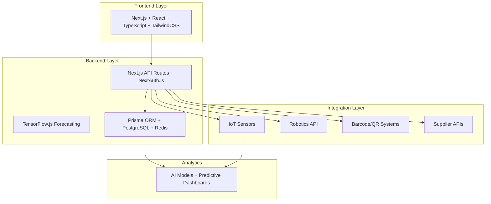

# 🚀 Automated Storage Retrieval System (ASRS)

> **Enterprise-grade full-stack warehouse automation platform** built with **Next.js**, **Prisma**, **PostgreSQL**, **TensorFlow.js**, and **IoT/Robotics integration**.
> ASRS provides **AI-powered inventory optimization**, **real-time analytics**, **predictive demand forecasting**, and **robotic control** for fully automated warehouse operations.

---

## 🧩 Tech & Platform Badges


---

## 🏗️ System Overview

ASRS integrates **AI-driven logistics**, **IoT monitoring**, and **robotic automation** in a modular architecture.

### 🧱 High-Level Architecture



---

## 💡 Core Features

### 🏷 Inventory & Warehouse Management

* Full SKU, batch, and expiry tracking
* Real-time updates with automated reconciliation
* Multi-unit and multi-warehouse support
* Reorder point automation and stock alerts

### ⚙️ AI-Powered Optimization

* **Smart Putaway:** AI algorithms optimize storage locations for space and efficiency
* **Order Picking:** Genetic routing for minimal travel paths
* **Demand Forecasting:** TensorFlow.js-based predictive analysis

### 📡 IoT & Robotics Integration

* Live temperature, humidity, and weight monitoring
* Integration with industrial sensors and PLC systems
* Robotic control via API commands (path planning, collision avoidance)

### 🧠 Predictive Analytics

* Demand forecasting and capacity planning
* ABC classification, space utilization heatmaps
* Automated KPI dashboards with anomaly detection

### 📦 Barcode & QR Operations

* Barcode/QR code generation, validation, and scanning
* Mobile-friendly interface with **HTML5 QR Code API**
* Bulk operations for inbound/outbound logistics

### 🕌 Halal & Regulatory Compliance

* Halal certification lifecycle tracking
* Regulatory compliance (HACCP, FDA, GMP, OSHA)
* Supplier certification verification and documentation

---

## 🧰 Advanced Modules

| Module                        | Description                                      |
| ----------------------------- | ------------------------------------------------ |
| **E-commerce Fulfillment**    | Multi-order batch picking, live order sync       |
| **Cold Chain Logistics**      | Temperature-controlled zone management           |
| **Pharmaceutical Tracking**   | Lot quarantine, serialization, and expiry        |
| **Manufacturing Integration** | Raw material flow and JIT operations             |
| **3PL & Multi-tenant**        | Multi-client operations with billing & analytics |

---

## 🛠 Tech Stack

| Layer               | Technology                                              |
| ------------------- | ------------------------------------------------------- |
| **Frontend**        | Next.js 15, React 19, TypeScript 5, TailwindCSS 4       |
| **Backend**         | Next.js API Routes, Prisma ORM, PostgreSQL, NextAuth.js |
| **AI/ML**           | TensorFlow.js (Demand Forecasting, Optimization)        |
| **IoT Integration** | HTML5 QR Code, Sensor APIs                              |
| **Cloud**           | Vercel, AWS, Railway, Docker                            |
| **Analytics**       | Recharts, Lucide, Custom KPI Engine                     |

---

## ⚡ Quick Start

```bash
# 1. Clone repository
git clone https://github.com/your-org/asrs-system.git
cd asrs-system

# 2. Install dependencies
npm install

# 3. Setup environment
cp .env.example .env.local

# 4. Initialize database
npx prisma generate
npx prisma db push

# 5. Run development server
npm run dev
```

🖥️ Visit → [http://localhost:3000](http://localhost:3000)

---

## 📦 Deployment

### 🚀 Vercel (Recommended)

```bash
vercel --prod
```

### 🐳 Docker

```bash
docker build -t asrs-system .
docker run -p 3000:3000 asrs-system
```

### ☁️ AWS / Railway

* Connect PostgreSQL instance
* Add environment variables
* Deploy containerized image

---

## 🔐 Security & Compliance

* **NextAuth.js** with secure JWT sessions
* **RBAC (Role-Based Access Control)** for user privileges
* **Zod Validation** for API payload integrity
* **Encrypted Database Storage**
* **GDPR, ISO27001, and SOC2 ready**

---

## 📈 Monitoring & KPIs

* Inventory Turnover
* Picking Accuracy
* Space Utilization
* Robot Efficiency
* Demand Forecast Accuracy
* Temperature & Sensor Reliability

📊 Integrated dashboards visualize **operational, predictive, and maintenance KPIs** in real time.

---

## 🧠 AI & Machine Learning Capabilities

| Feature                        | Model                      |
| ------------------------------ | -------------------------- |
| **Demand Forecasting**         | TensorFlow.js RNN          |
| **Putaway Optimization**       | Reinforcement Learning     |
| **Picking Route Optimization** | Genetic Algorithm          |
| **Anomaly Detection**          | Autoencoder-based          |
| **Predictive Maintenance**     | Regression-based ML models |

---

## 🗺 Roadmap

| Phase                             | Focus                                  | Status         |
| --------------------------------- | -------------------------------------- | -------------- |
| **1. Core Platform**              | Inventory, Picking, Putaway, Analytics | ✅ Complete     |
| **2. Automation Layer**           | Robotics, IoT, Forecasting             | ✅ Complete     |
| **3. Mobile App & AR**            | Handheld UI, Voice Commands            | 🚧 In Progress |
| **4. ERP/Blockchain Integration** | SAP, Oracle, Traceability              | 🔮 Planned     |

---

## 🤝 Contributing

1. Fork the repo
2. Create a feature branch
3. Submit a PR following [Conventional Commits](https://www.conventionalcommits.org/)
4. Add unit tests and update documentation

```bash
git checkout -b feat/new-feature
npm run test
npm run build
git push origin feat/new-feature
```

---

## 📚 Documentation & Support

* 📘 **Docs:** [Wiki](https://github.com/your-org/asrs-system/wiki)
* 🐛 **Issues:** [GitHub Issues](https://github.com/your-org/asrs-system/issues)
* 💬 **Community:** [Discussions](https://github.com/your-org/asrs-system/discussions)
* 📧 **Support:** [support@your-company.com](mailto:support@your-company.com)

---

## 📝 License

Licensed under the **MIT License**.
See [LICENSE.md](LICENSE.md) for full terms.

