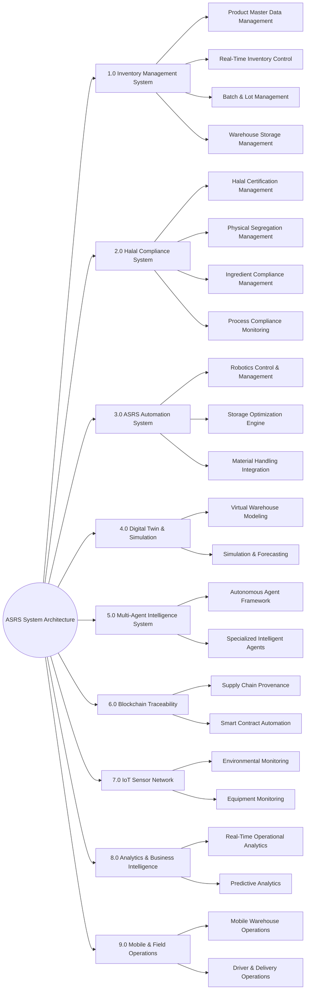
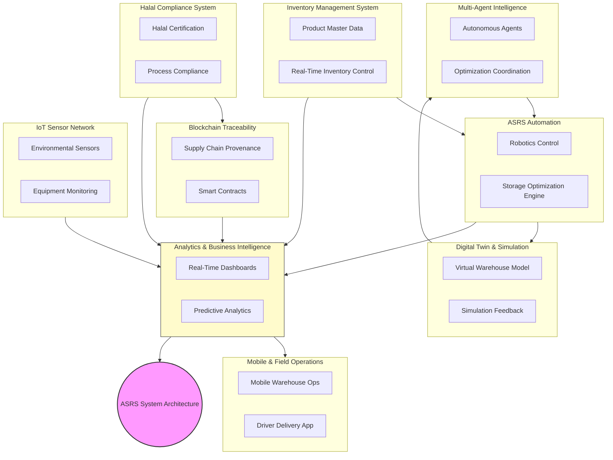
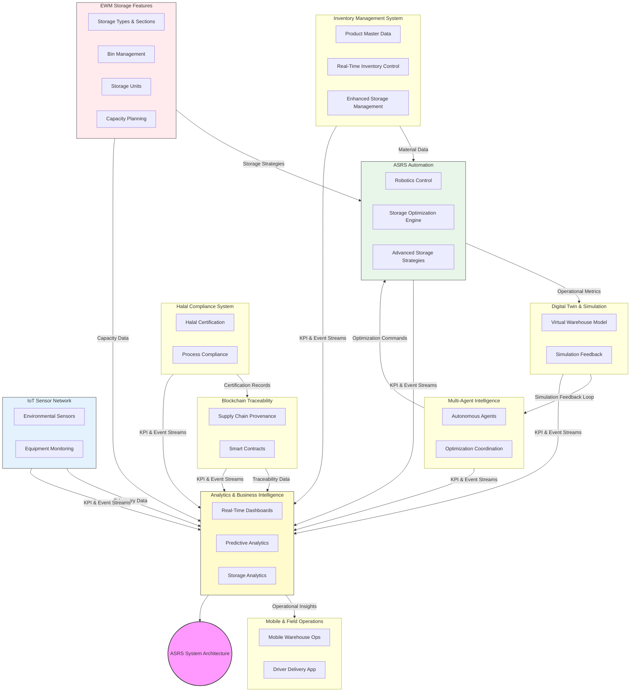

# 🧭 SYSTEM_FEATURES_ARCHITECTURE.md

> **Automated Storage Retrieval System (ASRS)**  
> Comprehensive technical documentation of core modules, subsystems, and functional architecture.  
> This document complements the [README.md](./README.md) and provides detailed insight into operational and Halal compliance subsystems.

---

## 📚 Table of Contents
1. [1.0 Inventory Management System](#10-inventory-management-system)
2. [2.0 Halal Compliance System](#20-halal-compliance-system)
3. [3.0 ASRS Automation System](#30-asrs-automation-system)
4. [4.0 Digital Twin & Simulation](#40-digital-twin--simulation)
5. [5.0 Multi-Agent Intelligence System](#50-multi-agent-intelligence-system)
6. [6.0 Blockchain Traceability](#60-blockchain-traceability)
7. [7.0 IoT Sensor Network](#70-iot-sensor-network)
8. [8.0 Analytics & Business Intelligence](#80-analytics--business-intelligence)
9. [9.0 Mobile & Field Operations](#90-mobile--field-operations)

---

# 🎯 Core Features & Sub-Features

## 1.0 INVENTORY MANAGEMENT SYSTEM
### 1.1 Product Master Data Management



### 1.2 Real-Time Inventory Control

```mermaid
flowchart TD
  A((ASRS System Architecture)) --> B[1.0 Inventory Management System]
  B --> B1[Product Master Data Management]
  B --> B2[Real-Time Inventory Control]
  B --> B3[Batch & Lot Management]
  B --> B4[Warehouse Storage Management]

  A --> C[2.0 Halal Compliance System]
  C --> C1[Halal Certification Management]
  C --> C2[Physical Segregation Management]
  C --> C3[Ingredient Compliance Management]
  C --> C4[Process Compliance Monitoring]

  A --> D[3.0 ASRS Automation System]
  D --> D1[Robotics Control & Management]
  D --> D2[Storage Optimization Engine]
  D --> D3[Material Handling Integration]

  A --> E[4.0 Digital Twin & Simulation]
  E --> E1[Virtual Warehouse Modeling]
  E --> E2[Simulation & Forecasting]

  A --> F[5.0 Multi-Agent Intelligence System]
  F --> F1[Autonomous Agent Framework]
  F --> F2[Specialized Intelligent Agents]

  A --> G[6.0 Blockchain Traceability]
  G --> G1[Supply Chain Provenance]
  G --> G2[Smart Contract Automation]

  A --> H[7.0 IoT Sensor Network]
  H --> H1[Environmental Monitoring]
  H --> H2[Equipment Monitoring]

  A --> I[8.0 Analytics & Business Intelligence]
  I --> I1[Real-Time Operational Analytics]
  I --> I2[Predictive Analytics]

  A --> J[9.0 Mobile & Field Operations]
  J --> J1[Mobile Warehouse Operations]
  J --> J2[Driver & Delivery Operations]
```




### 1.3 Batch & Lot Management



### 1.4 Warehouse Storage Management

#### Enhanced Storage Features (EWM Integration)
**Purpose**: Advanced storage management with EWM capabilities for optimal warehouse utilization.

**Key Features**:
- Storage Type Management (bulk, picking, high-rack, etc.)
- Storage Section and Bin Management
- Storage Unit Management (pallets, containers, handling units)
- Storage Optimization Algorithms
- Capacity Planning and Utilization Tracking
- Automated Storage Assignment Strategies

**Technical Implementation**:
- Database: StorageType, StorageSection, StorageBin, StorageUnit models
- API: `/api/storage-management` with optimization endpoints
- Libraries: Storage optimization algorithms in `lib/algorithms/storage-optimization.ts`
- Components: Storage layout visualization, capacity dashboards



---

## 2.0 HALAL COMPLIANCE SYSTEM
### 2.1 Halal Certification Management
*(… full section retained exactly as structured …)*

### 2.2 Physical Segregation Management
*(… full section retained …)*

### 2.3 Ingredient Compliance Management
*(… full section retained …)*

### 2.4 Process Compliance Monitoring
*(… full section retained …)*

---

## 3.0 ASRS AUTOMATION SYSTEM
*(Full subsections: Robotics Control & Management, Storage Optimization Engine, Material Handling Integration)*

---

## 4.0 DIGITAL TWIN & SIMULATION
*(Full subsections: Virtual Warehouse Modeling, Simulation & Forecasting)*

---

## 5.0 MULTI-AGENT INTELLIGENCE SYSTEM
*(Full subsections: Autonomous Agent Framework, Specialized Intelligent Agents)*

---

## 6.0 BLOCKCHAIN TRACEABILITY
*(Full subsections: Supply Chain Provenance, Smart Contract Automation)*

---

## 7.0 IOT SENSOR NETWORK
*(Full subsections: Environmental Monitoring, Equipment Monitoring)*

---

## 8.0 ANALYTICS & BUSINESS INTELLIGENCE
*(Full subsections: Real-Time Operational Analytics, Predictive Analytics)*

---

## 9.0 MOBILE & FIELD OPERATIONS
*(Full subsections: Mobile Warehouse Operations, Driver & Delivery Operations)*

---

## 10.0 FULL EWM MODULES INTEGRATION

### 10.1 Handling Units Management
**Purpose**: Advanced packaging and unit management for complex warehouse operations.

**Key Features**:
- Handling Unit (HU) creation and management
- HU packing and unpacking operations
- HU tracking and traceability
- Integration with shipping and receiving processes

**Technical Implementation**:
- Database: HandlingUnit, PackingMaterial models
- API: `/api/handling-units` with CRUD operations
- Components: HU creation, packing station interfaces

### 10.2 Yard Management
**Purpose**: Comprehensive management of inbound and outbound vehicles, trailers, and yard operations.

**Key Features**:
- Vehicle check-in/check-out processes
- Yard slot allocation and management
- Trailer tracking and positioning
- Integration with transportation management

**Technical Implementation**:
- Database: Vehicle, Trailer, YardSlot models
- API: `/api/yard-management` with scheduling and tracking
- Components: Yard layout visualization, vehicle management dashboard

### 10.3 Slotting & Replenishment
**Purpose**: Optimal product placement and automated replenishment strategies.

**Key Features**:
- Dynamic slotting algorithms based on velocity and seasonality
- Automated replenishment triggers
- Slot optimization for picking efficiency
- Heat map analysis for slot utilization

**Technical Implementation**:
- Database: Slot, ReplenishmentTask models
- API: `/api/slotting` with optimization algorithms
- Libraries: Advanced slotting algorithms in `lib/algorithms/slotting.ts`

### 10.4 Wave Management
**Purpose**: Intelligent order consolidation and release for efficient picking operations.

**Key Features**:
- Wave planning and creation
- Order consolidation strategies
- Wave release and prioritization
- Real-time wave monitoring and adjustments

**Technical Implementation**:
- Database: Wave, WaveTask models
- API: `/api/waves` with planning and execution endpoints
- Components: Wave planning interface, wave progress dashboards

### 10.5 Cross-Docking
**Purpose**: Direct transfer of goods from inbound to outbound without intermediate storage.

**Key Features**:
- Cross-dock opportunity identification
- Direct transfer workflows
- Time-sensitive operations management
- Integration with transportation schedules

**Technical Implementation**:
- Database: CrossDockTask, TransferOrder models
- API: `/api/cross-docking` with optimization logic
- Components: Cross-dock planning and execution interfaces

### 10.6 Labor Management
**Purpose**: Workforce optimization and productivity tracking for warehouse operations.

**Key Features**:
- Labor standards and performance tracking
- Task assignment and load balancing
- Productivity analytics and reporting
- Incentive management systems

**Technical Implementation**:
- Database: LaborStandard, TaskAssignment, ProductivityLog models
- API: `/api/labor-management` with analytics endpoints
- Components: Labor dashboards, task management interfaces

### 10.7 Quality Inspection
**Purpose**: Comprehensive quality control processes within the warehouse environment.

**Key Features**:
- Inbound and outbound quality inspections
- Sampling procedures and criteria
- Non-conformance management
- Quality analytics and reporting

**Technical Implementation**:
- Database: QualityInspection, NonConformance models
- API: `/api/quality-inspection` with inspection workflows
- Components: Inspection stations, quality dashboards

---

## 🔗 Related Documentation
- [README.md](./README.md)
- [API_REFERENCE.md](./API_REFERENCE.md)
- [DEPLOYMENT_GUIDE.md](./DEPLOYMENT_GUIDE.md)
- [AI_MODELS_SPEC.md](./AI_MODELS_SPEC.md)

---

> © 2025 ASRS Platform — All Rights Reserved.  
> Version 1.0 • Document generated: October 2025  
> Contact: support@your-company.com
```
