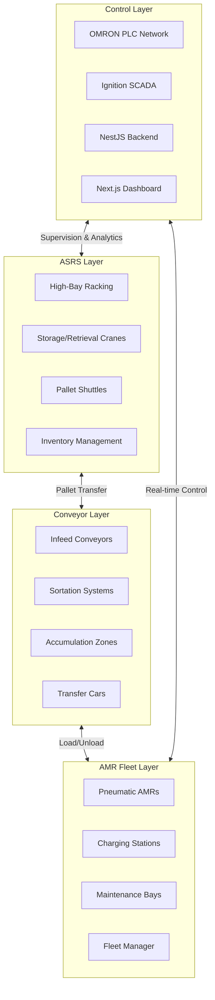
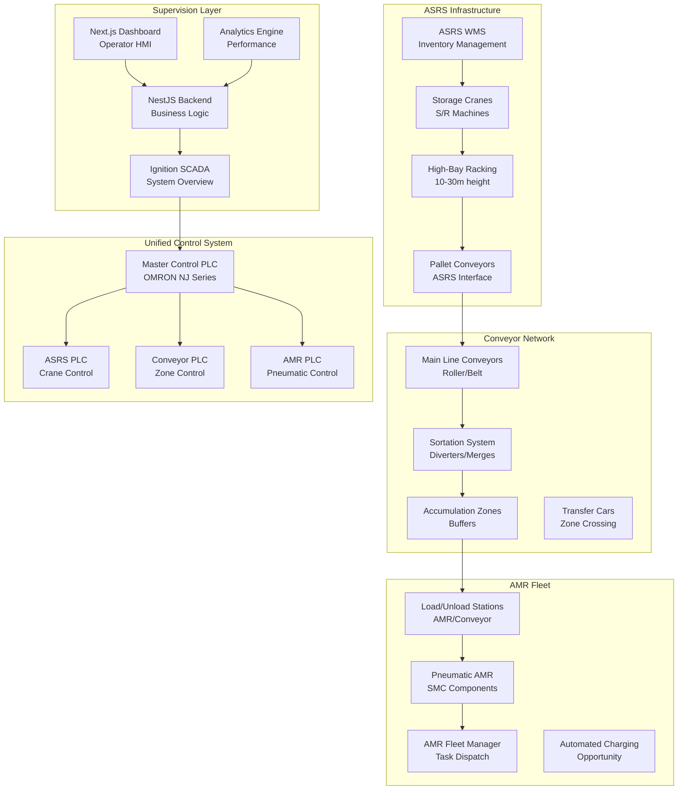
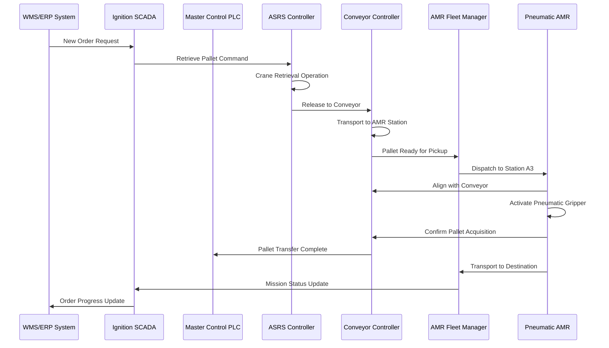
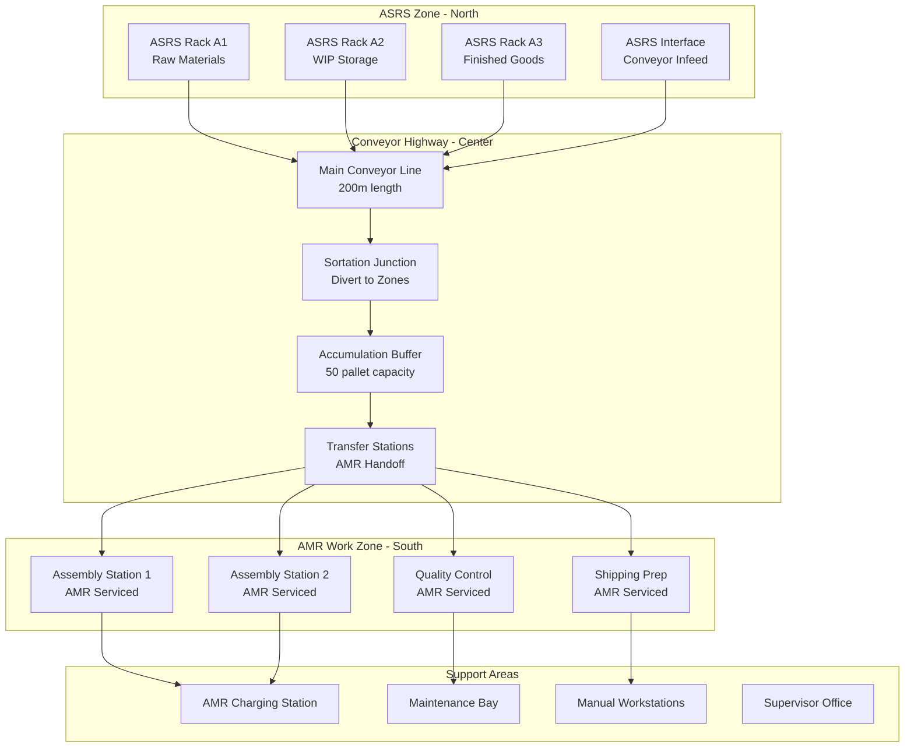
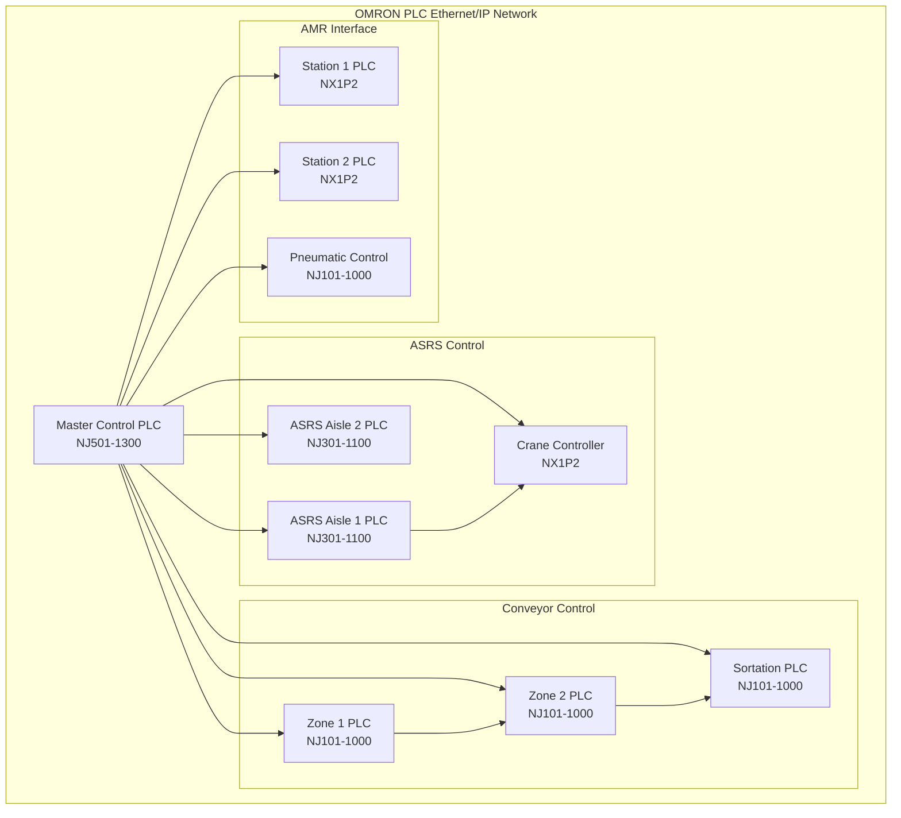
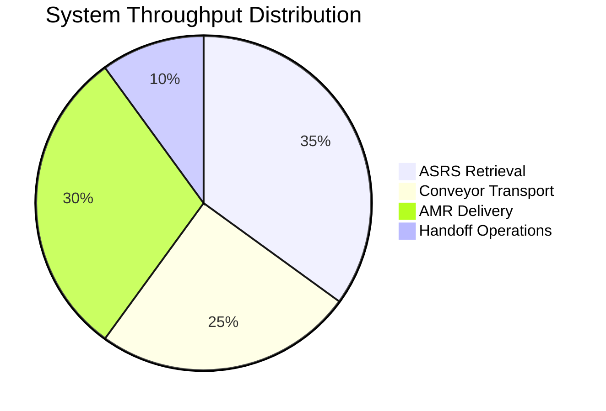

# AUTONOMOUS MOBILE ROBOT 

### MATERIAL HANDLING SYSTEM - POWERED BY PNEUMATIC - ASRS & CONVEYOR INTEGRATION


## 🚀 Integrated Material Handling System



## 🏗️ Integrated System Architecture



## 🔄 Integrated Workflow



## 🏭 Physical Layout Integration



## 🔧 ASRS-AMR-Conveyor Interface



```mermaid
flowchart LR
    subgraph ASRS_INTERFACE [ASRS Handoff]
        ASRS_OUT[ASRS Output Conveyor]
        PHOTO_EYE[Photoeye Detection]
        BARCODE[Barcode Scanner]
        STOPPER[Pneumatic Stopper]
    end

    subgraph CONVEYOR_INTERFACE [Conveyor Transfer]
        ACCUMULATION[Accumulation Zone]
        DIVERTER[Powered Divert]
        LIFT[Lift & Transfer Unit]
        ALIGNMENT[Alignment Guides]
    end

    subgraph AMR_INTERFACE [AMR Handoff]
        AMR_LOAD[AMR Load Position]
        PNEUMATIC[Pneumatic Gripper]
        SENSORS[Position Sensors]
        SAFETY[Safety Laser Scanner]
    end

    ASRS_INTERFACE --> CONVEYOR_INTERFACE
    CONVEYOR_INTERFACE --> AMR_INTERFACE

    style ASRS_INTERFACE fill:#e1f5fe
    style CONVEYOR_INTERFACE fill:#f3e5f5
    style AMR_INTERFACE fill:#e8f5e8
```

## 🎯 Integrated Control Logic

### Master Control System (OMRON PLC)

```structured-text
// Master Control Program - ASRS-AMR-Conveyor Coordination
PROGRAM MainSystemCoordinator
VAR
    // ASRS Interface Signals
    ASRS_PalletReady : BOOL;
    ASRS_PalletID : STRING[20];
    ASRS_RetrieveCommand : BOOL;
    
    // Conveyor Control Signals
    Conv_Position : ARRAY[1..10] OF BOOL;
    Conv_MotorSpeed : INT;
    Conv_DivertCommand : BOOL;
    
    // AMR Fleet Signals
    AMR_Available : BOOL;
    AMR_AssignedTask : BOOL;
    AMR_AtStation : BOOL;
    AMR_LoadComplete : BOOL;
    
    // Pneumatic System
    Pneumatic_GripperExtended : BOOL;
    Pneumatic_ClampActive : BOOL;
    Pneumatic_PressureOK : BOOL;
END_VAR

// Main Coordination State Machine
CASE SystemState OF
    0: // Idle - Wait for ASRS command
        IF ASRS_PalletReady THEN
            SystemState := 10;
        END_IF
        
    10: // Convey pallet to AMR station
        Conv_DivertCommand := TRUE;
        IF Conv_Position[5] THEN
            SystemState := 20;
        END_IF
        
    20: // Dispatch AMR and prepare handoff
        IF AMR_Available THEN
            AMR_AssignedTask := TRUE;
            SystemState := 30;
        END_IF
        
    30: // Execute pneumatic handoff
        IF AMR_AtStation AND Conv_Position[5] THEN
            Pneumatic_GripperExtended := TRUE;
            SystemState := 40;
        END_IF
        
    40: // Confirm load and release
        IF Pneumatic_ClampActive AND Pneumatic_PressureOK THEN
            AMR_LoadComplete := TRUE;
            Conv_DivertCommand := FALSE;
            SystemState := 50;
        END_IF
        
    50: // Complete cycle
        SystemState := 0;
END_CASE
```

## 📊 System Integration API

### NestJS Backend Services

```typescript
// apps/api/src/modules/integration/integration.service.ts
import { Injectable } from '@nestjs/common';
import { OpcuaService } from '../opcua/opcua.service';
import { MqttService } from '../mqtt/mqtt.service';

@Injectable()
export class IntegrationService {
  constructor(
    private opcuaService: OpcuaService,
    private mqttService: MqttService,
  ) {}

  async executeMaterialTransfer(transferRequest: TransferRequest) {
    const { source, destination, materialId, priority } = transferRequest;

    // 1. Reserve ASRS retrieval
    await this.reserveASRSOperation(source, materialId);

    // 2. Configure conveyor route
    const route = await this.calculateConveyorRoute(source, destination);
    await this.configureConveyorSystem(route);

    // 3. Dispatch AMR to handoff point
    const amr = await this.selectAvailableAMR();
    await this.dispatchAMR(amr, route.handoffPoint);

    // 4. Monitor execution
    return this.monitorTransferExecution(transferRequest, amr);
  }

  private async configureConveyorRoute(route: ConveyorRoute) {
    // Set diverters, speeds, and accumulation zones
    const commands = [
      this.opcuaService.writeTag('Conv_Divert_1', route.divert1State),
      this.opcuaService.writeTag('Conv_Speed_Main', route.mainSpeed),
      this.opcuaService.writeTag('Conv_Accum_Enable', route.accumulationEnable),
    ];

    await Promise.all(commands);
  }
}
```

## 🔌 PLC Network Integration



## 🎛️ SCADA Supervision Screens

### Integrated Monitoring Dashboard

```typescript
// apps/web/app/integrated-dashboard/page.tsx
export default function IntegratedDashboard() {
  const { systemStatus, transferMetrics, alarms } = useIntegratedSystem();

  return (
    <div className="grid grid-cols-12 gap-6 p-6">
      {/* ASRS Status Panel */}
      <div className="col-span-3">
        <Card>
          <CardTitle>ASRS Status</CardTitle>
        </CardHeader>
        <CardContent>
          <CraneStatus cranes={systemStatus.cranes} />
          <InventoryLevels levels={systemStatus.inventory} />
        </CardContent>
      </Card>
      </div>

      {/* Conveyor Network Panel */}
      <div className="col-span-6">
        <Card>
          <CardHeader>
            <CardTitle>Conveyor Network</CardTitle>
          </CardHeader>
          <CardContent>
            <ConveyorMap zones={systemStatus.conveyorZones} />
            <ThroughputMetrics metrics={transferMetrics} />
          </CardContent>
        </Card>
      </div>

      {/* AMR Fleet Panel */}
      <div className="col-span-3">
        <Card>
          <CardHeader>
            <CardTitle>AMR Fleet</CardTitle>
          </CardHeader>
          <CardContent>
            <FleetStatus amrs={systemStatus.amrFleet} />
            <PneumaticSystem pressure={systemStatus.pneumaticPressure} />
          </CardContent>
        </Card>
      </div>

      {/* Transfer Control Panel */}
      <div className="col-span-12">
        <TransferControlPanel />
      </div>
    </div>
  );
}
```

## 📈 Performance Analytics

### Key Integration Metrics

```typescript
// apps/api/src/modules/analytics/integration-metrics.service.ts
@Injectable()
export class IntegrationMetricsService {
  async calculateSystemOEE(): Promise<SystemOEE> {
    const [asrsOEE, conveyorOEE, amrOEE] = await Promise.all([
      this.calculateASRSOEE(),
      this.calculateConveyorOEE(),
      this.calculateAMROEE(),
    ]);

    // Integrated OEE considers handoff efficiency
    const handoffEfficiency = await this.calculateHandoffEfficiency();
    
    return {
      overall: (asrsOEE * conveyorOEE * amrOEE * handoffEfficiency) * 100,
      components: {
        asrs: asrsOEE * 100,
        conveyor: conveyorOEE * 100,
        amr: amrOEE * 100,
        handoff: handoffEfficiency * 100,
      },
      timestamp: new Date(),
    };
  }

  private async calculateHandoffEfficiency(): Promise<number> {
    const successfulHandoffs = await this.transferLogRepository.count({
      where: { status: 'COMPLETED', handoffSuccessful: true },
    });

    const totalHandoffs = await this.transferLogRepository.count({
      where: { status: 'COMPLETED' },
    });

    return totalHandoffs > 0 ? successfulHandoffs / totalHandoffs : 1;
  }
}
```

## 🚀 Deployment & Operation

### Starting the Integrated System

```bash
# Start all services
docker-compose -f docker-compose.integrated.yml up -d

# Initialize ASRS system
curl -X POST http://localhost:4000/api/asrs/initialize

# Start conveyor network
curl -X POST http://localhost:4000/api/conveyor/start

# Deploy AMR fleet
curl -X POST http://localhost:4000/api/amr-fleet/deploy

# Monitor system status
curl http://localhost:4000/api/integration/status
```

### System Health Monitoring

```typescript
// Health check endpoints
const healthEndpoints = {
  asrs: 'http://asrs-controller:8080/health',
  conveyor: 'http://conveyor-controller:8081/health',
  amr: 'http://amr-fleet:8082/health',
  plc: 'opc.tcp://plc-network:4840',
  scada: 'http://ignition-gateway:8088',
};

// Comprehensive health check
async function performSystemHealthCheck() {
  const results = await Promise.allSettled([
    this.checkASRSHealth(),
    this.checkConveyorHealth(),
    this.checkAMRFleetHealth(),
    this.checkPLCNetworkHealth(),
    this.checkSCADAHealth(),
  ]);

  return this.aggregateHealthResults(results);
}
```

---

<div align="center">

## 🏭 Complete Material Handling Ecosystem

### ASRS + Conveyor + AMR Integration




**Seamless Integration** • **High Throughput** • **Automated Material Flow**

</div>

> This integrated system creates a complete automated material handling solution where ASRS provides high-density storage, conveyors handle high-speed transport between zones, and AMRs deliver flexible final-meter delivery to workstations. The pneumatic AMR system enables secure handling of various load types while maintaining the flexibility of autonomous navigation.
