# ASRS System - Complete Page Map & Navigation Layout

## 🗺️ System Architecture Map

```mermaid
graph TB
    subgraph "Core Dashboard"
        HOME[🏠 Dashboard /]
        AMR[🤖 AMR Fleet /Autonomous-Mobile-Robots]
    end

    subgraph "Core ASRS Operations"
        ROBOTS[🤖 Robotics Control /robots]
        EQUIPMENT[⚙️ Equipment /equipment]
        SENSORS[🌡️ IoT Sensors /sensors]
        OPERATIONS[🎯 Operations Center /operations]
        ALERTS[🚨 Alerts /alerts]
        MAINTENANCE[🔧 Maintenance /maintenance]
    end

    subgraph "Inventory Management"
        INVENTORY[📦 Inventory /inventory]
        ITEMS[📋 Items & Products /items]
        PRODUCTS[🛍️ Products /products]
        SUPPLIERS[🏢 Suppliers /suppliers]
        BARCODE[📱 Barcode Scanner /barcode-scanner]
    end

    subgraph "Operations & Logistics"
        OPERATIONS_SUB[📋 Operations /operations]
        PUTAWAY[📥 Putaway /operations/putaway]
        SHIPMENTS[🚛 Shipments /shipments]
        TRANSACTIONS[💳 Transactions /transactions]
        MOVEMENTS[🔄 Movements /movements]
    end

    subgraph "Location Management"
        LOCATIONS[📍 Locations /locations]
        ZONES[🏭 Zones /zones]
        RACKS[🗄️ Racks /racks]
    end

    subgraph "EWM Advanced Modules"
        STORAGE[🏪 Storage Management /storage-management]
        HANDLING[📦 Handling Units /handling-units]
        YARD[🚛 Yard Management /yard-management]
        SLOTTING[🎯 Slotting /slotting]
        WAVES[🌊 Waves /waves]
        CROSS_DOCK[🔄 Cross-Docking /cross-docking]
        LABOR[👥 Labor Management /labor-management]
        QUALITY[✅ Quality Inspection /quality-inspection]
    end

    subgraph "Analytics & Intelligence"
        ANALYTICS[📊 Analytics /analytics]
        FORECASTING[📈 Forecasting /forecasting]
        DIGITAL_TWIN[🔮 Digital Twin /digital-twin]
        OPTIMIZATION[⚡ Optimization /optimization]
        REPORTS[📄 Reports /reports]
    end

    subgraph "Specialized Features"
        BLOCKCHAIN[⛓️ Blockchain /blockchain]
        IPFS[🌐 IPFS Storage /ipfs]
        HALAL[🕌 Halal Management /halal]
        HALAL_DASH[📊 Halal Dashboard /halal-dashboard]
    end

    subgraph "System Configuration"
        SETTINGS[⚙️ Settings /settings]
    end

    %% Navigation Flow
    HOME --> AMR
    HOME --> OPERATIONS
    HOME --> ANALYTICS
    
    AMR --> ROBOTS
    AMR --> MAINTENANCE
    AMR --> ANALYTICS
    
    OPERATIONS --> ROBOTS
    OPERATIONS --> SENSORS
    OPERATIONS --> EQUIPMENT
    
    INVENTORY --> ITEMS
    INVENTORY --> PRODUCTS
    INVENTORY --> SUPPLIERS
    
    SHIPMENTS --> TRANSACTIONS
    SHIPMENTS --> MOVEMENTS
    SHIPMENTS --> LOCATIONS
    
    ANALYTICS --> FORECASTING
    ANALYTICS --> REPORTS
    ANALYTICS --> DIGITAL_TWIN
```



## 📋 Complete Page Implementation Status

### ✅ Fully Implemented (11 pages)
| Page | Route | Status | Features |
|------|-------|--------|----------|
| Dashboard | `/` | ✅ Complete | Real-time KPIs, Navigation hub |
| AMR Fleet | `/Autonomous-Mobile-Robots` | ✅ Complete | Fleet monitoring, Navigation CTAs |
| Equipment | `/equipment` | ✅ Complete | Real-time status, Control actions |
| Inventory | `/inventory` | ✅ Complete | Multi-tab interface, Analytics |
| Alerts | `/alerts` | ✅ Complete | Real-time notifications, Filtering |
| Maintenance | `/maintenance` | ✅ Complete | Task management, Scheduling |
| Sensors | `/sensors` | ✅ Complete | IoT monitoring, Calibration |
| Robots | `/robots` | ✅ Complete | Command control, Fleet management |
| Analytics | `/analytics` | ✅ Complete | Real-time charts, KPIs |
| Operations | `/operations` | ✅ Complete | Control center, Equipment map |
| Shipments | `/shipments` | ✅ Complete | Logistics management, Tracking |

### 🔄 Recently Updated (1 page)
| Page | Route | Status | Features |
|------|-------|--------|----------|
| Transactions | `/transactions` | 🔄 Updated | Modern hooks, Navigation, Filtering |

### 🚧 Ready for Implementation (25+ pages)

#### Core Operations (4 pages)
| Page | Route | Priority | Implementation Plan |
|------|-------|----------|-------------------|
| Movements | `/movements` | High | Use transactions pattern + movement-specific features |
| Locations | `/locations` | High | Location hierarchy, Zone integration |
| Items | `/items` | High | Product catalog, Supplier integration |
| Products | `/products` | Medium | Manufacturing details, Specifications |

#### Logistics & Operations (6 pages)
| Page | Route | Priority | Implementation Plan |
|------|-------|----------|-------------------|
| Putaway | `/operations/putaway` | High | Task management, Location optimization |
| Suppliers | `/suppliers` | Medium | Vendor management, Performance tracking |
| Zones | `/zones` | Medium | Warehouse organization, Equipment mapping |
| Racks | `/racks` | Medium | Storage structure, Capacity management |
| Barcode Scanner | `/barcode-scanner` | Medium | HTML5 scanning, Item lookup |
| Reports | `/reports` | Medium | Report generation, Export functionality |

#### EWM Advanced (8 pages)
| Page | Route | Priority | Implementation Plan |
|------|-------|----------|-------------------|
| Storage Management | `/storage-management` | Medium | Capacity optimization, Space utilization |
| Handling Units | `/handling-units` | Medium | Pallet/container management |
| Yard Management | `/yard-management` | Medium | Dock scheduling, Trailer management |
| Slotting | `/slotting` | Low | Optimization algorithms, Replenishment |
| Waves | `/waves` | Low | Batch processing, Order grouping |
| Cross-Docking | `/cross-docking` | Low | Direct transfer operations |
| Labor Management | `/labor-management` | Low | Performance tracking, Standards |
| Quality Inspection | `/quality-inspection` | Low | QC processes, Compliance |

#### Advanced Features (7 pages)
| Page | Route | Priority | Implementation Plan |
|------|-------|----------|-------------------|
| Forecasting | `/forecasting` | Medium | AI/ML predictions, Demand planning |
| Digital Twin | `/digital-twin` | Low | 3D visualization, Simulation |
| Optimization | `/optimization` | Low | Algorithm configuration, Performance tuning |
| Blockchain | `/blockchain` | Low | Traceability, Smart contracts |
| IPFS | `/ipfs` | Low | Decentralized storage, File management |
| Halal Management | `/halal` | Low | Certification tracking, Compliance |
| Halal Dashboard | `/halal-dashboard` | Low | Halal-specific analytics |

#### System Configuration (1 page)
| Page | Route | Priority | Implementation Plan |
|------|-------|----------|-------------------|
| Settings | `/settings` | Medium | System configuration, User preferences |

## 🎯 Standard Implementation Template

### Page Structure Template
```typescript
'use client';

import React from 'react';
import { useRouter } from 'next/navigation';
import { Card, CardContent, CardDescription, CardHeader, CardTitle } from '@/components/ui/card';
import { Button } from '@/components/ui/button';
import { Alert, AlertDescription } from '@/components/ui/alert';
import { DataTable, FilterPanel, StatusBadge } from '@/components/shared';
import { use[ModuleName] } from '@/lib/hooks/use[ModuleName]';
import { useWebSocket } from '@/lib/websocket';
import { Icons } from 'lucide-react';

export default function [ModuleName]Page() {
  const router = useRouter();
  const {
    [module]s,
    filtered[Module]s,
    [module]Stats,
    isLoading,
    error,
    filters,
    setFilters,
    clearFilters,
    create[Module],
    refresh[Module]s
  } = use[Module]s();
  
  const { isConnected } = useWebSocket();

  // Navigation functions
  const navigateToDetail = (id: string) => router.push(`/[module]/${id}`);
  const navigateToAnalytics = () => router.push('/analytics');
  const navigateToRelated = () => router.push('/related-module');

  // Filter and column configurations
  const filterOptions = [/* ... */];
  const columns = [/* ... */];

  if (isLoading) {
    return <LoadingComponent />;
  }

  return (
    <div className="space-y-6">
      {/* Header with CTAs */}
      <HeaderSection />
      
      {/* Error handling */}
      {error && <ErrorAlert />}
      
      {/* Statistics cards */}
      <StatsCards />
      
      {/* Main content with filters and data table */}
      <MainContent />
    </div>
  );
}
```

### Hook Template
```typescript
import React from 'react';
import { useQuery, useMutation, useQueryClient } from '@tanstack/react-query';
import { use[Module]Store } from '@/lib/stores/[module]';

export const use[Module]s = () => {
  const queryClient = useQueryClient();
  const store = use[Module]Store();

  const { data, isLoading, error, refetch } = useQuery({
    queryKey: ['[module]s'],
    queryFn: fetch[Module]s,
    staleTime: 5 * 60 * 1000,
  });

  // Mutations and effects
  
  return {
    [module]s: data || store.[module]s,
    filtered[Module]s: store.filtered[Module]s,
    [module]Stats: store.[module]Stats,
    isLoading: isLoading || store.loading,
    error: error?.message || store.error,
    filters: store.filters,
    setFilters: store.setFilters,
    clearFilters: store.clearFilters,
    create[Module]: createMutation.mutate,
    refresh[Module]s: refetch,
  };
};
```

### Store Template
```typescript
import { create } from 'zustand';

interface [Module]State {
  [module]s: [Module][];
  loading: boolean;
  error: string | null;
  filters: Record<string, any>;

  // Actions
  set[Module]s: ([module]s: [Module][]) => void;
  add[Module]: ([module]: [Module]) => void;
  update[Module]: (id: string, updates: Partial<[Module]>) => void;
  setLoading: (loading: boolean) => void;
  setError: (error: string | null) => void;
  setFilters: (filters: any) => void;
  clearFilters: () => void;

  // Computed
  get filtered[Module]s(): [Module][];
  get [module]Stats(): Record<string, number>;
}

export const use[Module]Store = create<[Module]State>((set, get) => ({
  // Implementation
}));
```

## 🚀 Implementation Strategy

### Phase 1: High Priority Core (4 pages) - Week 1
1. **Movements** - Critical for operations tracking
2. **Locations** - Foundation for all operations
3. **Items** - Core inventory functionality
4. **Products** - Product catalog management

### Phase 2: Medium Priority Operations (6 pages) - Week 2
1. **Putaway** - Warehouse operations
2. **Suppliers** - Vendor management
3. **Zones** - Warehouse organization
4. **Racks** - Storage structure
5. **Barcode Scanner** - Operational efficiency
6. **Reports** - Business intelligence

### Phase 3: Advanced EWM (8 pages) - Week 3-4
1. **Storage Management** - Space optimization
2. **Handling Units** - Container management
3. **Yard Management** - Dock operations
4. **Settings** - System configuration
5. **Forecasting** - Predictive analytics
6. **Slotting** - Optimization
7. **Waves** - Batch processing
8. **Cross-Docking** - Direct operations

### Phase 4: Specialized Features (7 pages) - Week 5
1. **Labor Management** - Performance tracking
2. **Quality Inspection** - QC processes
3. **Digital Twin** - Advanced visualization
4. **Optimization** - Algorithm tuning
5. **Blockchain** - Traceability
6. **IPFS** - Decentralized storage
7. **Halal Management** - Compliance

## 📊 Navigation Flow Patterns

### Primary Navigation Flows
1. **Dashboard → Operations → Equipment/Robots/Sensors**
2. **Dashboard → AMR Fleet → Robots → Maintenance**
3. **Dashboard → Inventory → Items → Suppliers**
4. **Dashboard → Analytics → Reports → Forecasting**
5. **Operations → Shipments → Transactions → Movements**

### Cross-Module Integration
- **Equipment ↔ Maintenance ↔ Alerts**
- **Inventory ↔ Items ↔ Products ↔ Suppliers**
- **Shipments ↔ Transactions ↔ Movements ↔ Locations**
- **Analytics ↔ Reports ↔ Forecasting ↔ Optimization**

This comprehensive map provides the blueprint for implementing all 25+ pages with consistent patterns, proper navigation, and full backend integration.